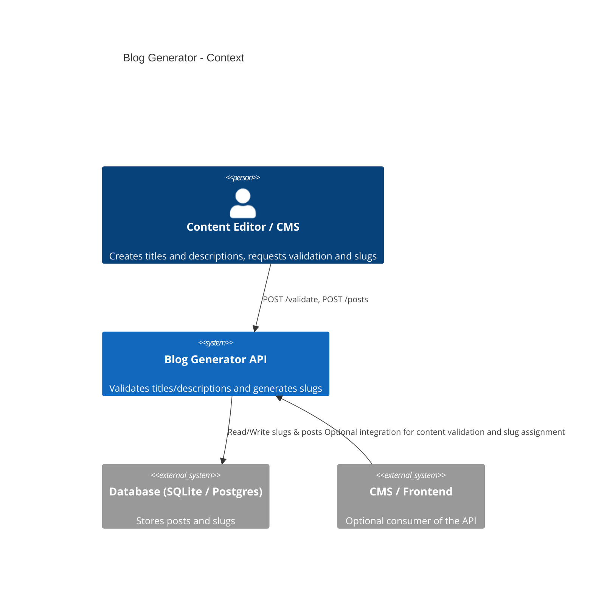

# Product Requirements Document for Blog Generator — SEO Title & Slug Validator API

## Overview

**Blog Generator — SEO Title & Slug Validator API** is a small REST service that validates blog post titles and descriptions for SEO best-practices and returns a canonical, unique slug. The initial implementation will be a Python REST API using FastAPI.

### Goals

- Validate titles and descriptions to meet SEO constraints and return clear validation errors.
- Generate predictable, URL-safe, unique slugs from titles.
- Provide a minimal, well-documented API suitable for integration with CMS, web frontends, and automation tools.

## Success Criteria

- The API validates title and description inputs according to the rules in this document and returns HTTP 4xx errors for invalid input.
- Slug generation is deterministic and ensures uniqueness (appends numeric suffixes when needed).
- The project has automated tests for validation and slug generation, and docs (OpenAPI + PRD).

---

## Stakeholders

- Product Owner: (project maintainer) — defines validation rules and acceptance tests.
- Backend Developer(s) — implement API, validation, slug algorithm, and tests.
- Integrators (CMS, frontend teams) — consume API to validate content and produce slugs.
- QA / Testers — verify validation rules and uniqueness behaviour.

---

## Functional Requirements

### FR1 Title Validation

- Title is required on create and must be a string.
- Length: minimum 3 characters, maximum 200 characters.
- Must contain at least one alphanumeric character; not only whitespace or control characters.
- Failure returns HTTP 422 with field-level errors.

### FR2 Description Validation

- Description (brief summary / meta description) is optional but recommended.
- If provided, trim whitespace. Recommended length range: 50–320 characters.
- Return warnings or validation errors if the description is outside reasonable SEO ranges (configurable).

### FR3 Slug Generation

- Server generates slug from `title` following the algorithm below. Client-provided slug is ignored.
- Algorithm (simple deterministic implementation):
  1. Normalize to lowercase.
  2. Trim leading/trailing whitespace.
  3. Replace any run of whitespace or separator characters with a single hyphen (`-`).
  4. Remove any character not in `a-z`, `0-9`, or `-`.
  5. Collapse multiple hyphens into one and trim hyphens at ends.
  6. Ensure uniqueness in storage by appending `-2`, `-3`, ... when collisions occur.

### FR4 API Endpoints (minimal)

- POST /validate
  - Request: { title, description? }
  - Response on success: { valid: true, slug: "generated-slug", warnings?: [] }
  - Response on validation error: HTTP 422 with `detail` and `errors` array.

- Optionally, CRUD endpoints for posts (POST /posts, GET /posts, GET /posts/{id} or /slug/{slug}, PUT/PATCH, DELETE) can be implemented reusing the same validation and slug logic.

### FR5 Error Responses

- All validation errors return consistent JSON with `detail` and an `errors` list describing field, message.

---

## Technical Requirements

### Technical Stack

- Language: Python 3.10+.
- Web framework: FastAPI.
- Validation: Pydantic models.
- Persistence (initial): no persistence
- Tests: pytest.
- Documentation: OpenAPI auto-generated by FastAPI; additional `docs/PRD.md` maintained in repo.

### Non-Functional Requirements

- Performance: average response time < 200 ms under normal load for single requests.
- Availability: targeted SLA for production deployments is 99.5% (configurable by infra).
- Security: validate and sanitize all inputs; protect against injection and overlarge payloads; enable rate-limiting when deployed behind a gateway.
- Observability: basic logs and request metrics; error reporting for uncaught exceptions.

### Compliance & Constraints

- No personal or sensitive data is stored as part of this service by default.
- If integrated into systems that contain personal data, ensure downstream compliance (e.g., GDPR) is the responsibility of the integrator.

---

## Context and Integrations

- Primary consumers: web frontends, CMS systems, automation scripts that prepare SEO metadata.
- Optional integrations: external CMS via webhook or direct API calls, databases (PostgreSQL), and reverse proxies for TLS, rate-limiting and auth.

## System C4 Context diagram

---

## Validation Rules (summary)

- Title: required, 3–200 chars, at least one alphanumeric.
- Description: optional, recommended 50–320 chars (configurable warnings).
- Slug: generated, lowercase, URL-safe, unique (numeric suffixes on collisions).

---

## Acceptance Criteria

- Unit tests for title/description validation cover expected edge cases.
- Unit/integration tests for slug generation and uniqueness behaviour.
- API returns OpenAPI schema and documentation via FastAPI's `/docs` endpoint.

---

## Next Steps

1. Implement minimal FastAPI app with `POST /validate` and tests for validation and slug generation.
2. Add optional persistence and `/posts` CRUD endpoints when integration needs arise.
3. Add CI to run tests and linting.

> End of PRD for Blog Generator — SEO Title & Slug Validator API, last updated on 2025-11-18.
